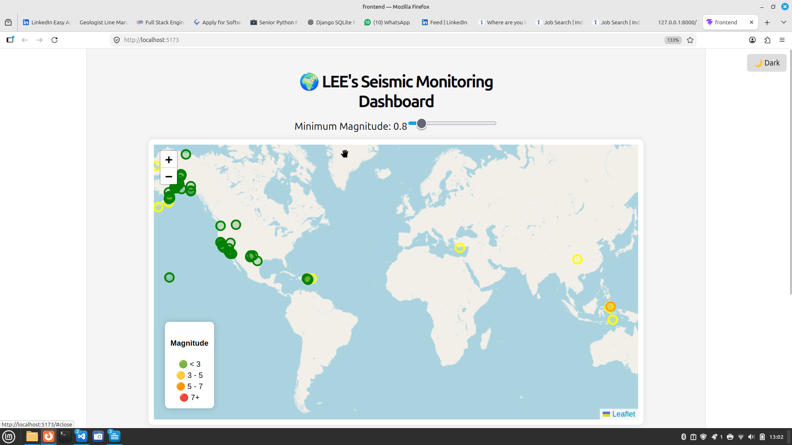
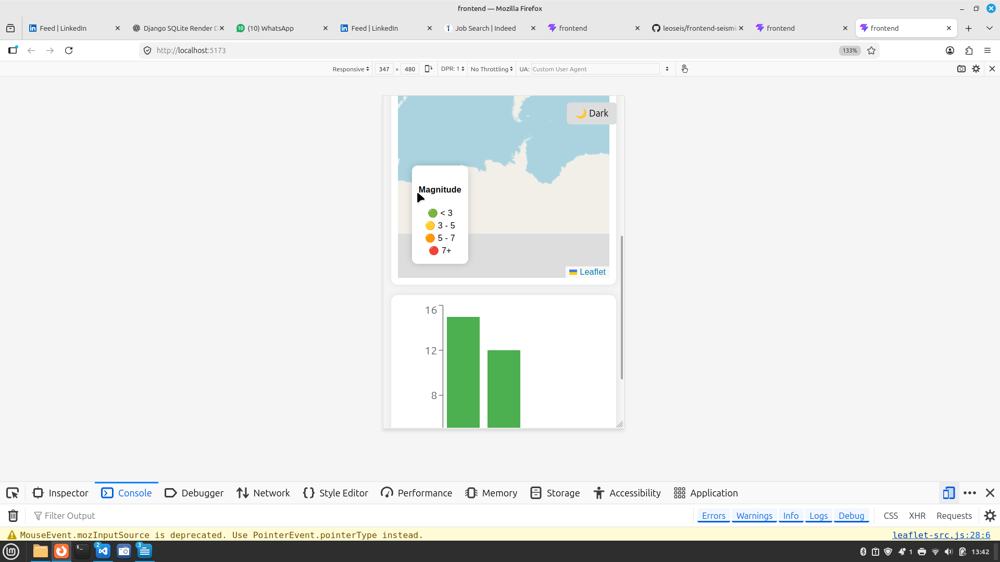
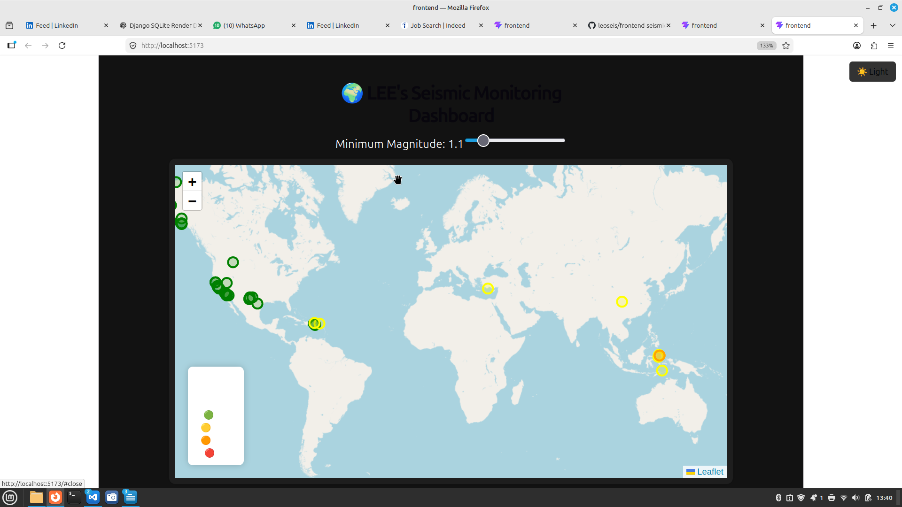

# 🌍 Seismic Monitoring Dashboard

A full-stack seismic data visualization dashboard built with **Django REST Framework** and **React**.
It displays earthquake events on an interactive map, provides statistical insights, and supports real-time user interaction.

---

## 🚀 Live Demo

* Frontend: https://your-vercel-link.vercel.app
* Backend API: https://your-render-link.onrender.com

---

## 🧠 Features

* 🌍 Interactive earthquake map (Leaflet)
* 📊 Data visualization with charts (Recharts)
* 🎯 Magnitude filtering slider
* 📌 Clickable markers with detailed sidebar
* 📍 Reverse geocoding (lat/lng → real location)
* 🌙 Dark mode toggle
* ⚡ Loading skeleton UI
* 📱 Fully responsive (mobile + desktop)

---

## 🛠 Tech Stack

### Frontend

* React (Vite)
* Axios
* React Leaflet
* Recharts

### Backend

* Django
* Django REST Framework
* SQLite (for now)
* CORS headers

### Deployment

* Frontend: Vercel
* Backend: Render

---

## 📸 Screenshots

### 🖥 Desktop View



### 📱 Mobile View



### 🌙 Dark Mode



---

## ⚙️ Installation

### 1. Clone the repo

```bash
git clone https://github.com/your-username/seismic-dashboard.git
cd seismic-dashboard
```

---

### 2. Backend Setup (Django)

```bash
cd backend
python -m venv venv
source venv/bin/activate   # Linux/Mac
pip install -r requirements.txt

python manage.py migrate
python manage.py runserver
```

---

### 3. Frontend Setup (React)

```bash
cd frontend
npm install
npm run dev
```

---

## 🔐 Environment Variables

Create a `.env` file inside `frontend/`:

```env
VITE_API_URL=https://your-render-backend.onrender.com
VITE_GEOCODE_API_KEY=your_opencage_api_key
```

---

## 📡 API Endpoints

* `/api/earthquakes/` → list earthquakes
* `/api/latest/` → latest events
* `/api/filter/` → filter by magnitude

---

## 💡 Future Improvements

* 🔄 Real-time earthquake updates (WebSockets)
* 📊 Advanced analytics dashboard
* 🌍 Heatmap visualization
* 📦 PostgreSQL + Redis
* 🔐 User authentication

---

## 👨‍💻 Author

**Leonard Emelieze**

* Django + React Developer
* Seismologist

---

## ⭐ Acknowledgements

* OpenCage API (reverse geocoding)
* OpenStreetMap
* USGS earthquake data (if used)
